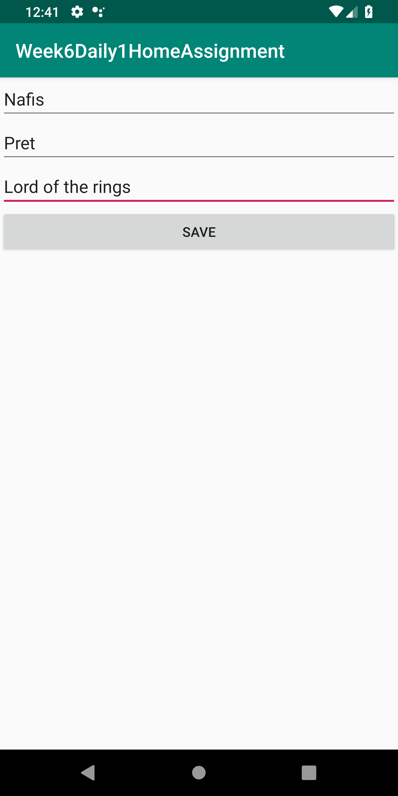
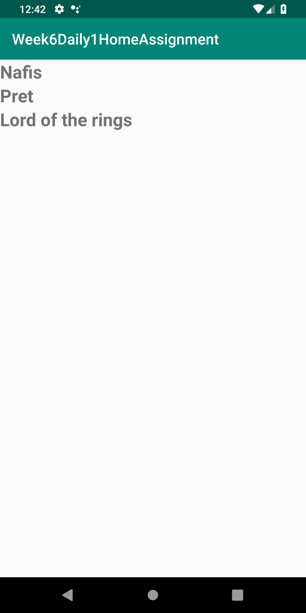

# Week6Daily1HomeAssignment
Write a application where the user enters Name, Favorite Book, and Favorite Movie in One activity, On a button click start another Activity that will display the data. Use MVVM. Write Junit test using assertions for the above

Providing information and saving it to display in next activity.

Displaying information.

